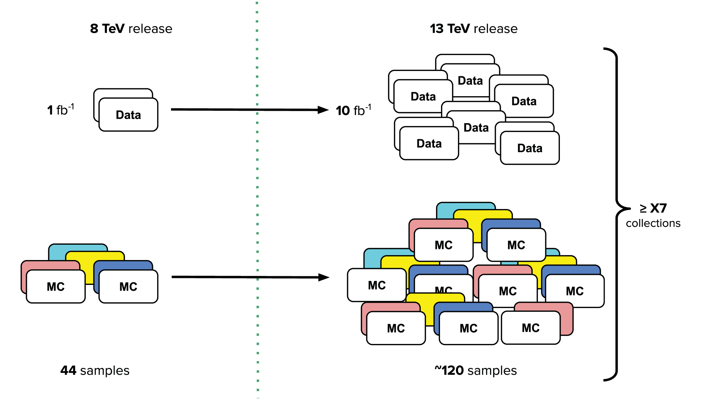

# Evolution of the ATLAS Open Data from the 8 TeV release (2016) to the 13 TeV release (2020)

The evolution of the ATLAS Open Data and the tuple structure from the [8 TeV release](http://opendata.cern.ch/search?page=1&size=20&experiment=ATLAS&collision_energy=8TeV&collision_type=pp) in 2016 to the [13 TeV release](./files.md) are depicted below: 

