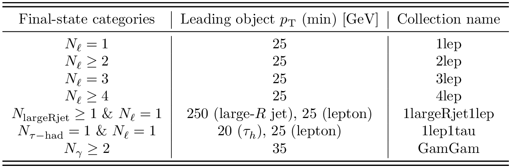

# Overview of 13 TeV ATLAS Open Data

A new set of pp collision data has been released by the ATLAS Collaboration to the public for educational purposes. The data has been collected by the ATLAS detector at the LHC at 13 TeV during the year 2016 and corresponds to an integrated luminosity of 10 fb-1. The pp collision data is accompanied by a set of MC simulated samples describing several processes which are used to model the expected distributions of different signal and background events.

+ The released samples are provided in a simplified data format, reducing the information content of the original data analysis format used within the ATLAS Collaboration. 

+ The resulting format is a [ROOT](https://root.cern.ch/) tuple with more than 80 branches. For those not familiar with this modular scientific software toolkit, please refer to the [ROOT documentation](https://root.cern.ch/documentation), which provides a rich set of tutorials and code examples. 

+ Several final-state collections are provided within the 13 TeV ATLAS Open Data release. The corresponding multiplicities of final-state objects, minimum transverse momentum requirements and collection names are shown below:

