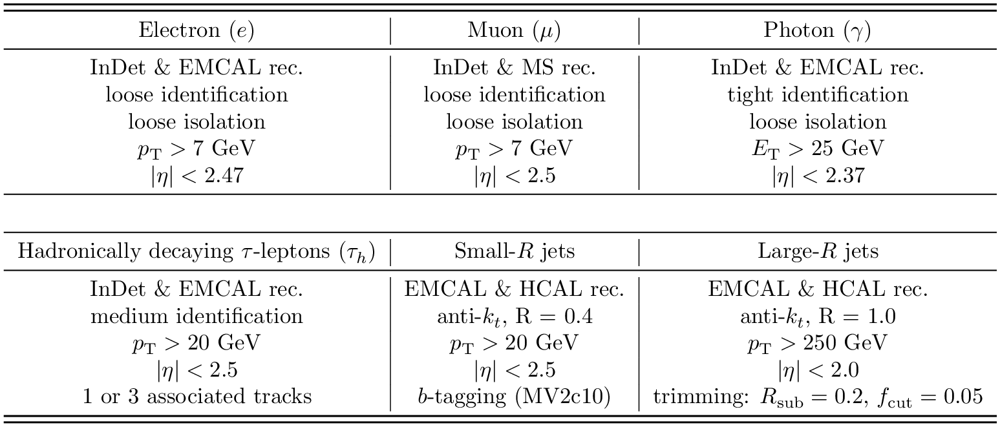

# Reconstructed physics objects within the 13 TeV ATLAS Open Data

Several reconstructed physics objects (**electrons, muons, photons, hadronically decaying tau-leptons, small-R jets, large-R jets**) are contained within the 13 TeV ATLAS Open Data, and their preselection requirements are detailed below:

--- 

The 13 TeV ATLAS Open Data events are selected by applying several event-quality and trigger criteria, and classified according to the type and multiplicity of reconstructed objects with high transverse momentum. Several standard selection requirements, referred to as **preselection**, are applied to each of the reconstructed physics objects within the 13 TeV ATLAS Open Data, as detailed in the table below:

In addition, several data quality criteria ensure that the detector was functioning properly and events are rejected if they contain reconstructed jets associated with energy deposits that can arise from hardware problems, beam-halo events or cosmic-ray showers. Furthermore, events are required to have at least one reconstructed vertex with two or more associated tracks.
