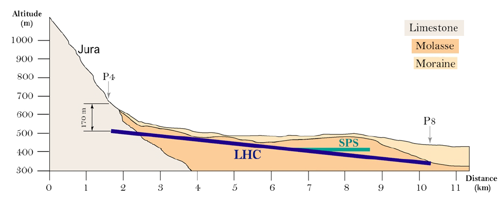

# **The Large Hadron Collider**

The main objective in a particle physics experiment is, often, to produce new particles by carrying out collisions. The choice of beam particle is governed by the particular objectives of the experiment. The particles that constitute the beam must be stable, and it should be
possible to produce and accelerate them in large numbers. Hence the most obvious choices are electrons, positrons, protons and anti-protons. The lower energy loss from synchrotron radiation is the main argument in favour of a hadron collider when a greater energy reach is the primary motivation, as is the case of the [Large Hadron Collider](https://home.cern/science/accelerators/large-hadron-collider) (LHC).

The Large Hadron Collider is a two-ring, superconducting accelerator and collider installed in a 27 km tunnel previously constructed for the Large Electron Positron (LEP) collider, located at the border of France and Switzerland and hosted by [Conseil Europeen pour la Recherche
Nucleaire](https://home.cern/) (CERN). The LHC has eight arcs and straight sections, which are approximately 528 m long. Four of the straight sections provide shelter for the LHC detectors whilst the other four are used for machine utilities, radio frequency, collimation and beam abort.

The LHC is the world’s largest and most powerful particle accelerator. It first started up on 10 September 2008, and remains the latest addition to CERN’s accelerator complex. The figure below shows the underground position of the LHC and the Super Proton Synchrotron (SPS), the second-largest machine in CERN's accelerator complex that measures nearly 7 kilometres in circumference.

For much more information about the LHC and the surrounding technologies, take a look at the main [CERN website](https://home.cern/science/accelerators/large-hadron-collider).
