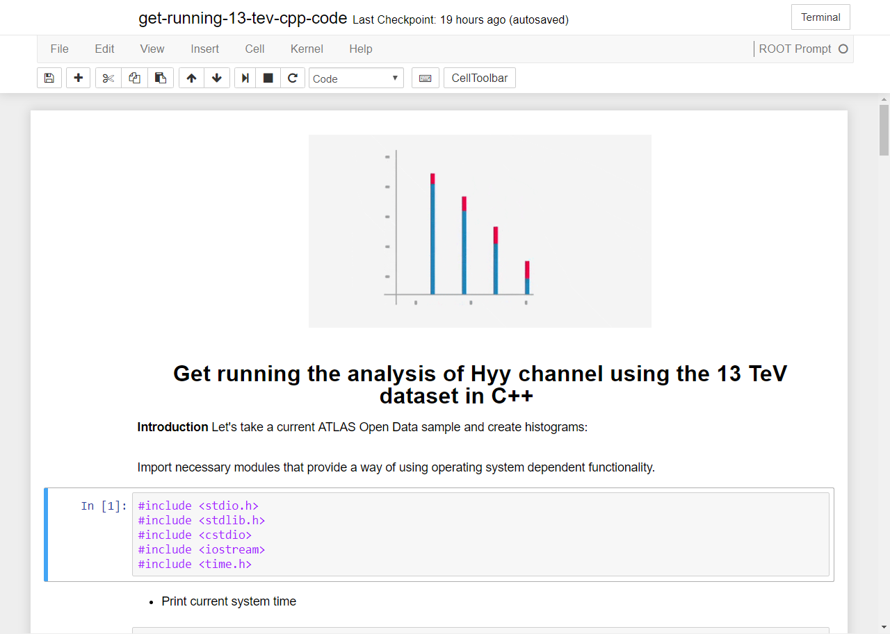

# ROOTbooks with a C++ framework interface

An interface to the [C++ analysis framework](../frameworks/cpp.md), written in *both C++ and Python* languages with Jupyter notebook and a ROOT kernel and PyROOT extension, is prepared and available under this [Github link](https://github.com/atlas-outreach-data-tools/demos-framework-software-notebooks).

From these two interfaces, the C++ based analysis framework for the 13 TeV ATLAS Open Data analysis can be executed online using the cloud computing services such as [SWAN](https://swan.web.cern.ch/) and [Binder](https://swan.web.cern.ch/) executable platforms.
