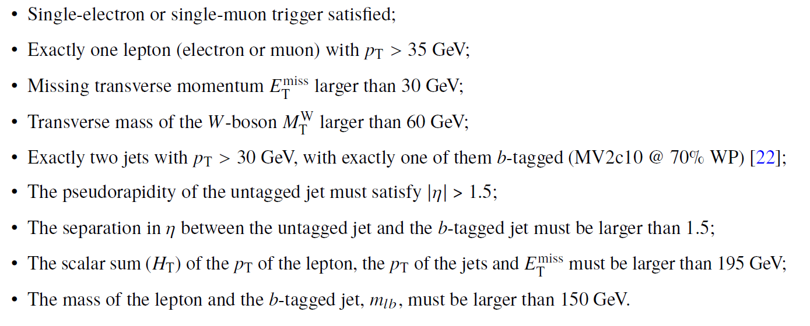
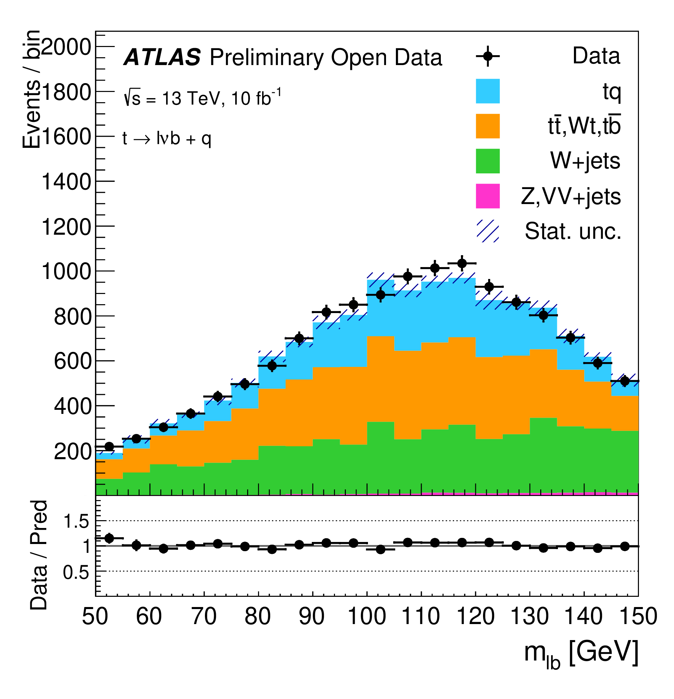

# Example of physics analysis: the case of t-channel single-top-quark production in the single-lepton final state

At hadron colliders, top quarks are predominantly produced in pairs via the flavour conserving strong interaction, but single top-quark production can occur via charged current electroweak processes involving a Wtb vertex. At leading order (LO) in quantum chromodynamics (QCD) perturbation theory, three sub-processes contribute to single top-quark production: an exchange of a virtual W boson either in the
t-channel or in the s-channel, or the associated production of a top quark with an on-shell W boson (Wt).

In pp collisions, the t-channel exchange is the dominant production process of single top quarks: an exchange of a space-like W boson due to the interaction of a light quark with a b-quark produces a top quark and a forward light-quark (called the spectator quark) in the final state.

In order to identify these events, one needs to apply the standard object-selection criteria (defined in "Reconstructed physics objects"), with a stricter lepton pT (> 35 GeV) and lepton calorimeter and tracking isolation (< 0.1) requirements and tight lepton identification criteria, and an event-selection criteria defined as:

At the end, one is able to compare data and MC prediction for the distribution of e.g. the mass of the lepton and the b-tagged jet, as seen below:

