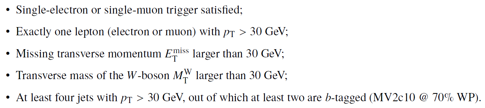
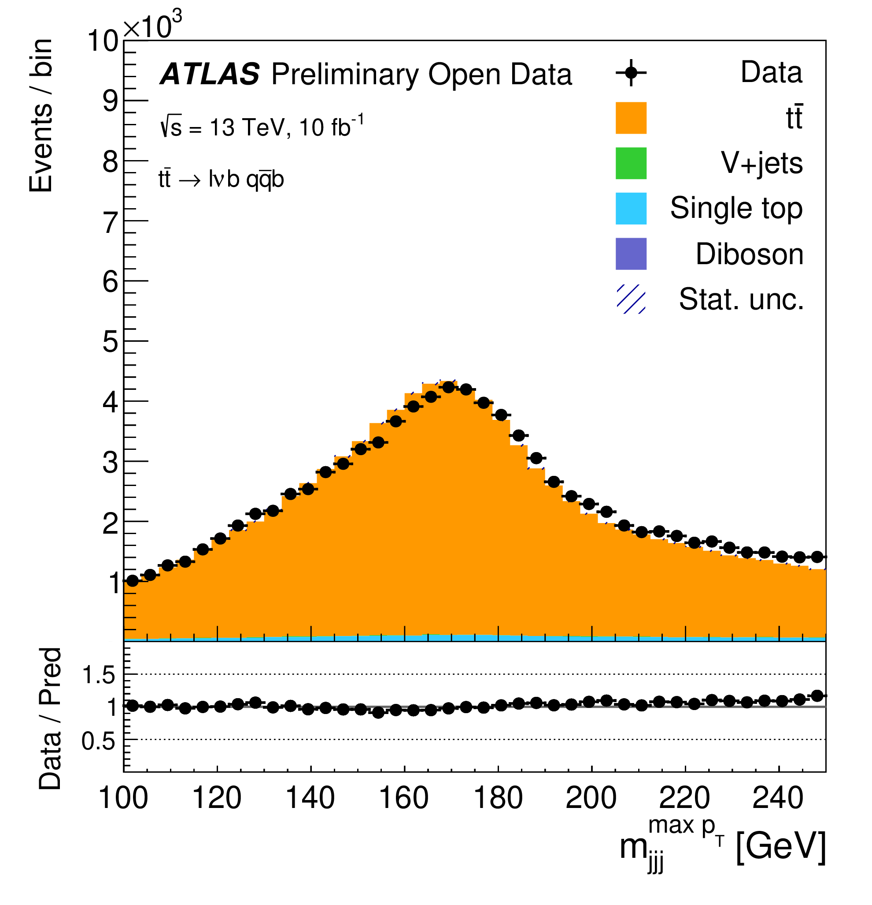

# Example of physics analysis: the case of the top-quark pair production in the single-lepton final state

The top quark is the heaviest elementary particle in the SM, with a mass mt of around 172.5 GeV, which is close to the electroweak symmetry breaking scale. At the LHC, top quarks are primarily produced in quark–antiquark pairs (tt), and due to its large production cross section ( around 830 pb at 13 TeV), the LHC can be viewed as "a top-quark factory". Top quarks have a rich phenomenology which includes high-pT jets, b-jets, leptons and missing transverse momentum. Its understanding is crucial for studying rarer processes, given that tt production is a background to virtually all processes having leptons and multiple jets in their final states.

In order to identify these events, one needs to apply the standard object-selection criteria (defined in "Reconstructed physics objects"), with a stricter lepton pT requirement and tight lepton identification criteria, and an event-selection criteria defined as:

At the end, one is able to compare data and MC prediction for the distribution of e.g. the invariant mass of the three-jets combination with the highest vector pT, as seen below:

