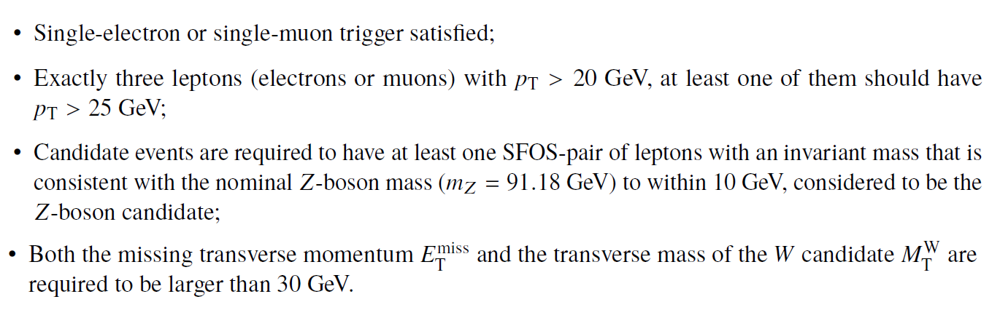

# Example of physics analysis: the case of SM WZ diboson production in the three-lepton final state

The study of the diboson production is an important part of the physics programme in hadron collisions as it represents an important test of the electroweak sector of the SM. In particular, the WZ diboson production arises from two vector bosons radiated by quarks or from the decay of a virtual W boson into a WZ pair, the latter of which involves a triple gauge coupling.

In order to identify these events, one needs to apply the standard object-selection criteria (defined in "Reconstructed physics objects") with a loose lepton pT requirement and tight lepton identification criteria, and an event-selection criteria defined as:

At the end, one is able to compare data and MC prediction for the distribution of e.g. the invariant mass of the reconstructed Z-boson candidate, as seen below.

