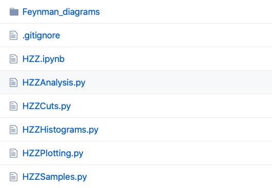
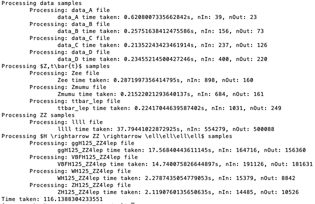

# Python uproot framework

## About
This is an analysis code that may be used to analyse the data of the ATLAS published dataset, and is available at this [Github link](https://github.com/atlas-outreach-data-tools/atlas-outreach-Python-uproot-framework-13tev)

This framework uses [Python](https://www.python.org) [uproot](https://github.com/scikit-hep/uproot) and [pandas](https://pandas.pydata.org)/[numpy](https://numpy.org) to have no dependency on [ROOT](https://root.cern.ch). This framework uses python3.

The 13 TeV ATLAS Open Data are **hosted** on the [CERN Open Data portal](http://opendata.cern.ch/) and [ATLAS Open Data portal](http://opendata.atlas.cern) in this [documentation](../datasets/files.md). The framework can access the samples in two ways:

+ reading them online directly (by default, they are stored in an [**online repository**](https://atlas-opendata.web.cern.ch/atlas-opendata/samples/2020/))
+ reading them form a local storage (the samples need to be downloaded locally).

The framework consists of **5 main files**:

+ the **Analysis** files perform the particular object selection;
+ the **Plotting** files make Data / Prediction plots from saved results;
+ the **Samples** files specify the particular samples to use;
+ the **Cuts** files specify the particular cuts to implement;
+ the **Histograms** files specify which plots to make.

---

## First Time Setup

>  python3 -m pip install -U numpy pandas uproot matplotlib lmfit tables --user

## Running
The files in the root directory of the installation are the various analysis codes.

You can run a preconfigured analysis via

>  python3 HZZAnalysis.py

The first portion of an analysis code specifies the packages that need to be imported:

>   import uproot    		     	(to read .root files)

>   import pandas as pd			(for dataframe to hold the data)

>   import time				(to time the code)

>   import math				(for mathematical functions such as trig)

>   import numpy as np			(for numeric calculations)

>   import matplotlib.pyplot as plt	(to make plots)

The second portion of an analysis code specifies information such as the locations of files:

>	tuple_path = "https://atlas-opendata.web.cern.ch/atlas-opendata/samples/2020/4lep/"	(file location)
>
>	stack_order = [r'$Z,t\bar{t}$','ZZ']					(order of coloured bars)

_XSamples.py_ contains the individual files that are to be used for the different processes:

>samples = {
>
>    'data': {
>        'list' : ['data_A','data_B','data_C','data_D']
>    },
> ...
>}

The names chosen for the processes are important as they are the keys that are used later in the _infofile.py_ to determine the necessary
scaling factors for correct plotting.

Execution times are ~ 200 seconds.

### Plotting

The resulting plots will be saved in the root directory.

The _plot\_data_ function enables the user to steer the plotting process.
Each analysis has its own _plot\_data_ function to accomodate changes in histograms that the user may want to plot.

General information for plotting include the x axis located in the _XHistograms.py_ files:

>    'bin_width':5,
>    'num_bins':34,
>    'xrange_min':80,
>    'log_y':False,

The names of the histograms to be drawn can be specified like so:

>   mllll = {
>   ...
>   }
>
>   hist_dict = {'mllll':mllll}

# Definiton of plot content
Each plot consists of several aspects, which may include data and errors.
A definition of plot content may look like this:

>        data_x,_ = np.histogram(data['data'][x_variable].values/1000, bins=bins)
>        data_x_errors = np.sqrt(data_x)
>
>        signal_x = None
>        if signal_format=='line':
>            signal_x,_ = np.histogram(data[signal][x_variable].values/1000,bins=bins,weights=data[signal].totalWeight.values)
>        elif signal_format=='hist':
>            signal_x = data[signal][x_variable].values/1000
>            signal_weights = data[signal].totalWeight.values
>            signal_color = HZZSamples.samples[signal]['color']
>    
>        mc_x = []
>        mc_weights = []
>        mc_colors = []
>        mc_labels = []
>        mc_x_tot = np.zeros(len(bin_centres))
>
>        for s in stack_order:
>            mc_labels.append(s)
>            mc_x.append(data[s][x_variable].values/1000)
>            mc_colors.append(HZZSamples.samples[s]['color'])
>            mc_weights.append(data[s].totalWeight.values)
>            mc_x_heights,_ = np.histogram(data[s][x_variable].values/1000,bins=bins,weights=data[s].totalWeight.values)
>            mc_x_tot = np.add(mc_x_tot, mc_x_heights)
>    
>        mc_x_err = np.sqrt(mc_x_tot)

A _stack_ shows the different processes specified in "stack_order" stacked upon each other to give an idea of the composition of the simulated data.
The definitions for these individual processes are defined under _XSamples.py_. Each process has a certain colour and a list of contributing parts
that comprise it. These contributing parts are the keys used in both the run configuration and the _infofile.py_.

_data_ is geared toward the standard representation of data. Since the data does not need to be scaled there is no need
to align the used names in contributions with those found in the _infofile.py_. 

The defined plots can the be drawn like so:

>        plt.axes([0.1,0.3,0.85,0.65]) #(left, bottom, width, height)
>        main_axes = plt.gca()
>        main_axes.errorbar( x=bin_centres, y=data_x, yerr=data_x_errors, fmt='ko', label='Data')
>        mc_heights = main_axes.hist(mc_x,bins=bins,weights=mc_weights,stacked=True,color=mc_colors, label=mc_labels)
>        if Total_SM_label:
>            totalSM_handle, = main_axes.step(bins,np.insert(mc_x_tot,0,mc_x_tot[0]),color='black')
>        if signal_format=='line':
>            main_axes.step(bins,np.insert(signal_x,0,signal_x[0]),color=HZZSamples.samples[signal]['color'], linestyle='--',
>                       label=signal)
>        elif signal_format=='hist':
>            main_axes.hist(signal_x,bins=bins,bottom=mc_x_tot,weights=signal_weights,color=signal_color,label=signal)
>        main_axes.bar(bin_centres,2*mc_x_err,bottom=mc_x_tot-mc_x_err,alpha=0.5,color='none',hatch="////",
>                  width=h_bin_width, label='Stat. Unc.')
>        
>        main_axes.set_xlim(left=h_xrange_min,right=bins[-1])
>        main_axes.xaxis.set_minor_locator(AutoMinorLocator()) # separation of x axis minor ticks
>        main_axes.tick_params(which='both',direction='in',top=True,labeltop=False,labelbottom=False,right=True,labelright=False)
>        main_axes.set_ylabel(r'Events / '+str(h_bin_width)+r' GeV',fontname='sans-serif',horizontalalignment='right',y=1.0,fontsize=11)
>        if h_log_y:
>            main_axes.set_yscale('log')
>            smallest_contribution = mc_heights[0][0]
>            smallest_contribution.sort()
>            bottom = smallest_contribution[-2]
>            top = np.amax(data_x)*h_log_top_margin
>            main_axes.set_ylim(bottom=bottom,top=top)
>            main_axes.yaxis.set_major_formatter(CustomTicker())
>            locmin = LogLocator(base=10.0,subs=(0.1,0.2,0.3,0.4,0.5,0.6,0.7,0.8,0.9),numticks=12)
>            main_axes.yaxis.set_minor_locator(locmin)
>        else: 
>            main_axes.set_ylim(bottom=0,top=(np.amax(data_x)+math.sqrt(np.amax(data_x)))*h_linear_top_margin)
>            main_axes.yaxis.set_minor_locator(AutoMinorLocator())
>        
>        plt.text(0.05,0.97,'ATLAS',ha="left",va="top",family='sans-serif',transform=main_axes.transAxes,style='italic',weight='bold',fontsize=13)
>        plt.text(0.19,0.97,'Open Data',ha="left",va="top",family='sans-serif',transform=main_axes.transAxes,fontsize=13)
>        plt.text(0.05,0.9,'for education only',ha="left",va="top",family='sans-serif',transform=main_axes.transAxes,style='italic',fontsize=8)
>        plt.text(0.05,0.86,r'$\sqrt{s}=13\,\mathrm{TeV},\;\int L\,dt=$'+lumi_used+'$\,\mathrm{fb}^{-1}$',ha="left",va="top",family='sans-serif',transform=main_axes.transAxes)
>        plt.text(0.05,0.78,plot_label,ha="left",va="top",family='sans-serif',transform=main_axes.transAxes)
>    
>        # Create new legend handles but use the colors from the existing ones 
>        handles, labels = main_axes.get_legend_handles_labels()
>        if signal_format=='line':
>            handles[labels.index(signal)] = Line2D([], [], c=HZZSamples.samples[signal]['color'], linestyle='dashed')
>        if Total_SM_label:
>            uncertainty_handle = mpatches.Patch(facecolor='none',hatch='////')
>            handles.append((totalSM_handle,uncertainty_handle))
>            labels.append('Total SM')
>    
>        # specify order within legend
>        new_handles = [handles[labels.index('Data')]]
>        new_labels = ['Data']
>        for s in reversed(stack_order):
>            new_handles.append(handles[labels.index(s)])
>            new_labels.append(s)
>        if Total_SM_label:
>            new_handles.append(handles[labels.index('Total SM')])
>            new_labels.append('Total SM')
>        else: 
>            new_handles.append(handles[labels.index('Stat. Unc.')])
>            new_labels.append('Stat. Unc.')
>        if signal is not None:
>            new_handles.append(handles[labels.index(signal)])
>            new_labels.append(signal_label)
>        main_axes.legend(handles=new_handles, labels=new_labels, frameon=False, loc=h_legend_loc)

The order of the stack is determined by "stack_order".

If everything was successful, the code will show output similar to below.

---

## In Depth Information

### Analysis Code
The analysis codes are located in the root folder.
They are used to make plots.

It is recommended to start out by modifying one of the existing analyses, e.g. the HZZAnalysis located in _HZZAnalysis.py_.

## Analyses

Analyses that have been implemented: HZZ, Hyy
