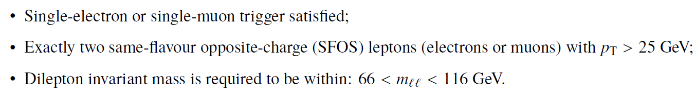

# Example of physics analysis: the case of the SM Z-boson production in the two-lepton final state

The study of Z-boson production in pp collisions provides a stringent test of perturbative QCD. In addition, the SM Z-boson process, often produced in association with one or more jets, is a significant background to searches for the SM Higgs boson and for physics beyond the SM.

In order to identify these events, one needs to apply the standard object-selection criteria (defined in "Reconstructed physics objects"), and leptons are required to pass tight identification criteria, and an event-selection criteria defined as:

At the end, one is able to compare data and MC prediction for the distribution of e.g. the di-muon invariant mass, as seen below:

