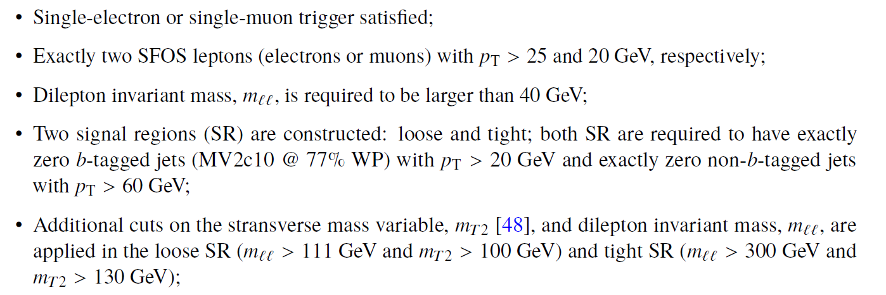
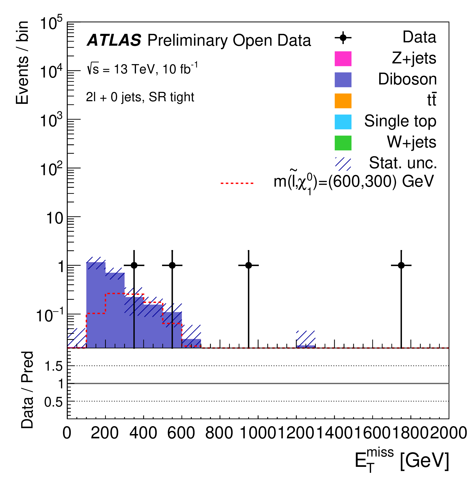

# Example of physics analysis: the case of a search for supersymmetric particles in the two-lepton final state

Supersymmetry (SUSY) is one of the most studied extensions of the SM. In its minimal form it predicts new fermionic (bosonic) partners of the fundamental SM bosons (fermions) and an additional Higgs doublet. These new SUSY particles, or "sparticles", can provide an elegant solution to the gauge hierarchy problem and provide a natural candidate for dark matter in cases where the lightest supersymmetric particle is a so called weekly interacting massive particle.

In the following, we are going to focus on a search for direct production of pairs of sleptons, the superpartners of the SM leptons, where each slepton decays directly into the lightest neutralino and the corresponding lepton. A simplified benchmark model is chosen for this
search, in which the mass of the slepton and the neutralino are the only free parameters. The predicted cross section for slepton production, each with a mass of 600 GeV, and neutralino mass of 300 GeV is 0.7 fb.

In order to search for these events, one needs to apply the standard object-selection criteria (defined in "Reconstructed physics objects") with a loose lepton pT and loose lepton identification criteria, and an event-selection criteria defined as:

At the end, one is able to compare data and MC prediction for the distribution of e.g. the missing transverse momentum, as seen below. Interesting to note are the events observed in data at very high values (> 900 GeV). These have been investigated further and found to contain very high-pT calorimeter-tagged muons which passes the loose muon selection working point. By applying the tight identification criteria on the muons, these events are rejected.

