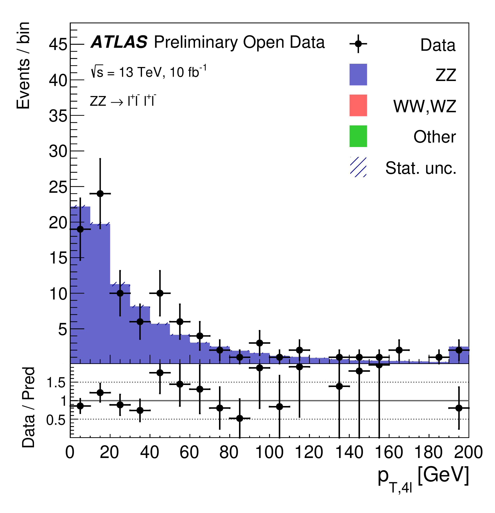

# Example of physics analysis: the case of SM ZZ diboson production in the four-lepton final state

The study of ZZ diboson production in pp interactions at the LHC not only can be used as a test of the electroweak sector of the SM. The SM ZZ production can proceed via a SM Higgs boson propagator, although this contribution is suppressed in the region where both Z bosons are produced on-shell. Hence, non-resonant ZZ diboson production is an important background for searches of the SM Higgs boson with
its subsequent decay to ZZ.

In order to identify these events, one needs to apply the standard object-selection criteria (defined in "Reconstructed physics objects") with a loose lepton pT requirement and tight lepton identification criteria, and an event-selection criteria defined as:

At the end, one is able to compare data and MC prediction for the distribution of e.g. the transverse momentum of the four-lepton system, as seen below.

