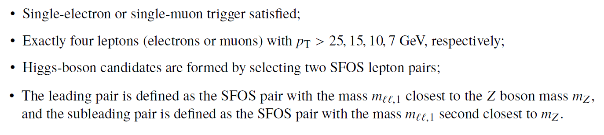

# Example of physics analysis: the case of SM Higgs boson production in the H &rarr; ZZ decay channel in the four-lepton final state

The search for the SM Higgs boson through the decay H &rarr;  ZZ &rarr; 4l, where l = e or &mu;, represents the so called "golden channel" and leads to a narrow four-lepton invariant-mass peak on top a relatively smooth and small background, largely due to the excellent momentum resolution of the ATLAS detector. The Higgs-boson decay branching ratio to the four-lepton final state for the Higgs boson mass of 125 GeV is predicted
to be 0.0124% in the SM, and the expected cross section times branching ratio for the process H &rarr; ZZ &rarr; 4l is 2.9 fb at 13 TeV.
Hence, based on an integrated luminosity of the current ATLAS Open Data set of 10/fb, one expects a total of 29 events to have been produced in the four-lepton final state (before reconstruction and event selection).

In order to identify these events, one needs to apply the standard object-selection criteria (defined in "Reconstructed physics objects") with a loose lepton pT requirement and loose lepton calorimeter- and track-based isolation requirements, and an event-selection criteria defined as:

At the end, one is able to compare data and MC prediction for the distribution of e.g. the four-lepton invariant mass, as seen below. An excess of events in the distribution of the four-lepton invariant mass near 125 GeV is observed, which corresponds to the expected in the SM production of the Higgs boson.

