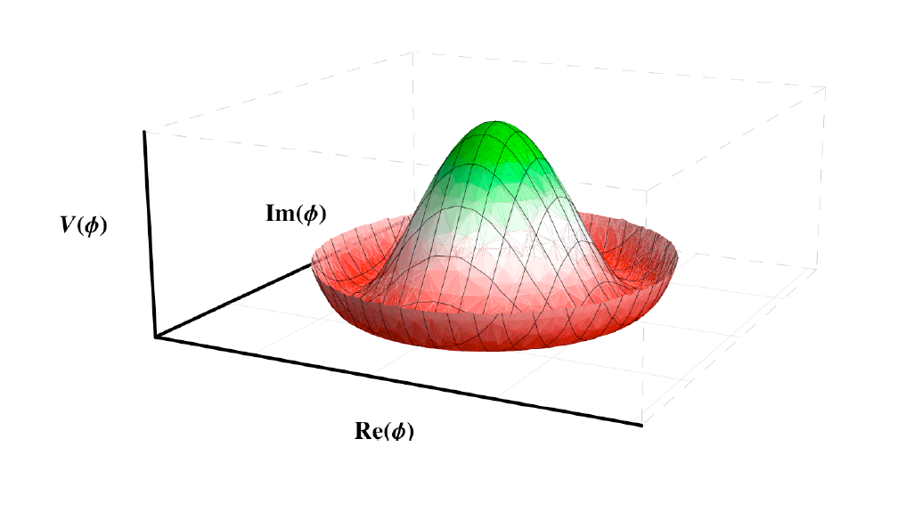
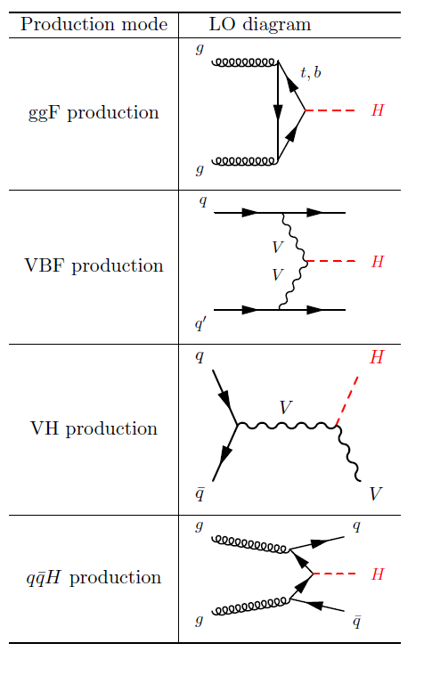
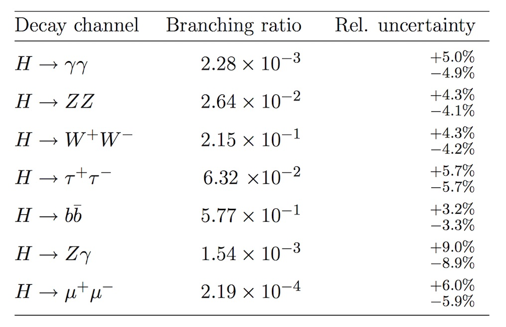

# Brief introduction to the Higgs Boson

The [Standard Model](http://atlas.cern/discover/physics) of particle physics is a theory that describes the known matter in terms of its elementary constituents and their interactions. It is a widely proven and very successful theory in modern physics.  

The Standard Model (SM) of particle physics postulates the existence of a complex scalar doublet with a vacuum expectation value, which spontaneously breaks the electroweak symmetry, gives masses to all the massive elementary particles in the theory, and gives rise to a physical scalar known as the **Higgs boson**. The [Higgs boson](https://home.cern/topics/higgs-boson) is a fundamental particle, first observed by ATLAS and CMS in 2012, although theorised in the 1960s. The Higgs boson is the carrier particle for the Higgs field, a field present throughout our universe, which gives particles their mass. The more a particle interacts with the Higgs field, the higher its mass.

An illustration of the "Mexican hat" shape of the Higgs field potential is presented below:

## Higgs boson production

Standard Model production of the Higgs boson at the LHC is dominated by the gluon fusion process (ggF), followed by the vector-boson fusion process (VBF). Associated production also have sizeable contributions, with a W or Z boson (VH) or a pair of top quarks (qqH).

The representative Feynman diagrams for the production processes are shown below:

The figure below shows the Standard Model Higgs boson production cross sections as a function of the centre-of-mass energy. If the cross-section value (left axis) is multiplied by the luminosity of the dataset to be analysed, that is effectively how many Higgs bosons are expected to be produced (for different LHC energies).

Quantum chromodynamics \(QCD\) and Electroweak \(EW\) models are used to predict the production cross sections. Next-to-leading order\(NLO\) and next-to-next-to leading order \(NNLO\) calculations are carried. High order corrections are required to achieve the desired precision for these predictions.

Currently, the SM Higgs boson mass has been measured to be 125.09 ± 0.24 [GeV](https://en.wikipedia.org/wiki/Electronvolt) by combining ATLAS and CMS [measurements](https://arxiv.org/abs/1503.07589).

---

## Higgs boson decay

According to the Standard Model \(SM\), the Higgs boson can decay into pairs of fermions or bosons. The Higgs boson mass is not predicted by the SM, but once measured the production cross sections and branching ratios can be precisely calculated.

The Standard Model Higgs boson decay branching ratios and total width are shown in the figure below \[[PDG](http://pdg.lbl.gov/2013/reviews/rpp2013-rev-higgs-boson.pdf)\]. You can see that the decay modes change depending on the mass of the Higgs boson. The figure represents how likely the Higgs boson is going to decay into a certain particle, or group of particles, depending on its mass.

The following table displays the branching ratios and the relative uncertainty for a Standard Model Higgs boson with a mass of 125 GeV.

The decay mode with the highest branching ratio \(BR\) is the decay to [hadrons](https://en.wikipedia.org/wiki/Hadron), with around 70\%, which is not easy to detect due to [multijet QCD](https://cds.cern.ch/record/1951336) backgrounds. A large fraction of the [leptonic](https://en.wikipedia.org/wiki/Lepton) decays are to a pair of [neutrinos](https://en.wikipedia.org/wiki/Neutrino), with around 20\%, which are difficult to detect since the neutrinos hardly interact with matter. The decay to pairs of electrons, muons and tau-leptons have a BR of about 10\% of the total. In fact, the tau [life time](https://en.wikipedia.org/wiki/Particle_decay) is very short, 3x10-13s, so it can be reconstructed only from its decay products. The efficiency of reconstructing tau-leptons is much lower than that of electrons and muons. 

