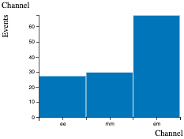
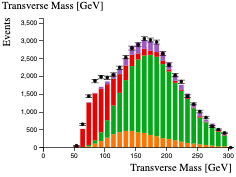
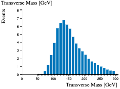
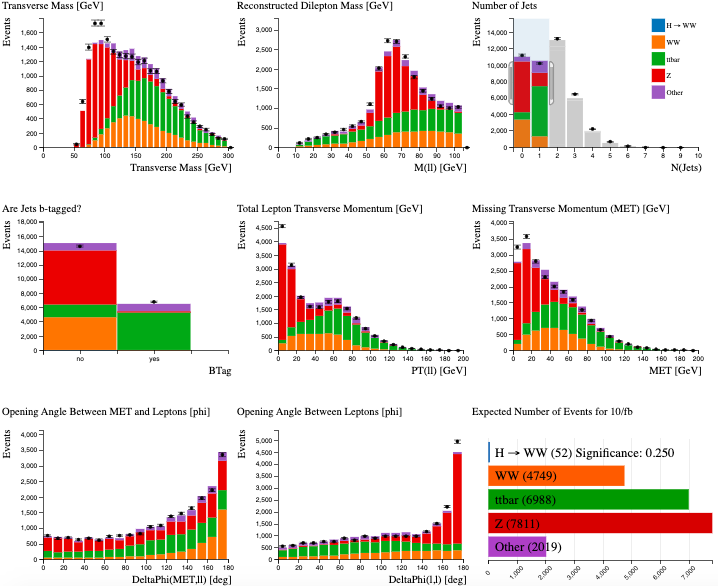

# Higgs to WW - simulated + real data

The second Histogram Analyser includes data. This is shown by the black dots, with error bars.

This second Histogram Analyser also includes minor backgrounds, labelled as 'Other' in purple. Minor backgrounds are required for data to match the total simulation. 'Other' includes single top production, \(WZ\) and \(ZZ\) diboson production, \(W\) boson production and \(H \rightarrow ZZ^* \rightarrow \ell^+\ell^-\ell^+\ell^-\) decay.

The histograms can take about 30 seconds to load. Whilst loading you'll only see the histogram titles. Once loaded you'll see the histograms appear under their titles.

We think it really helps to be able to see all nine histograms on your screen at the same time. So if this isn't the case to start with, we suggest decreasing the zoom in your web browser until you can see all nine (e.g 67%).

<iframe width="100%" height="950" src="CrossFilter/13TeV_hwwanalyser.html" frameborder="0" allowfullscreen></iframe>

Here we will just be looking at the electron-muon channel. Before, we had 124 Higgs candidates (see Events per Channel histogram below), now we are looking at just 66 Higgs candidates (see Number of Expected Events histogram above). However, the \(Z\) background is much reduced, so that makes it a good choice.

The numbers shown in Number of Expected Events is calculated by the simulated Monte Carlo, as before.

We have also added a new histogram, transverse mass. Transverse mass is analogous to invariant mass, but neglects the longitudinal momenta of the decay products.

Transverse mass, \(m_T\), is a useful quantity to define for use in particle physics as it is invariant under Lorentz boost along the z direction. In natural units it is:

\(m_T^2 = m^2 + p_x^2 + p_y^2 = E^2 - p_z^2\)

where the z-direction is along the beam pipe and so \(p_x\) and \(p_y\) are the momentum perpendicular to the beam pipe and \(m\) is the invariant mass.

In this study, transverse mass is defined as

\(m_T = ((E_T^{ll} + E_T^{miss})^2 - | p_T^{ll} + E_T^{miss} |^2 ) ^{1/2} \)

where 
\( E_T^{ll} = (|p_T^{ll}|^2 + m_{ll}^2 )^{1/2} \)

If you select just the Higgs events by clicking on the \(H \rightarrow WW\) in 'Expected Number of Events' histogram, you will see the transverse mass of the Higgs. As expected, it peaks at the mass of the Higgs, 125 GeV.

Select events with 2 jets by using your cursor to select N(Jets)=2. You will notice that both the data points and the simulated Monte Carlo distributions change. The data and simulated Monte Carlo are not exactly the same, but the general agreement is very good. This shows that these processes are well understood and well modelled.

As before, make some selections to separate the Higgs boson signal from the background.

Can you increase the significance to over 0.5 ?

Below is an event display, where a Higgs candidate has been identified decaying into an electron and muon.

