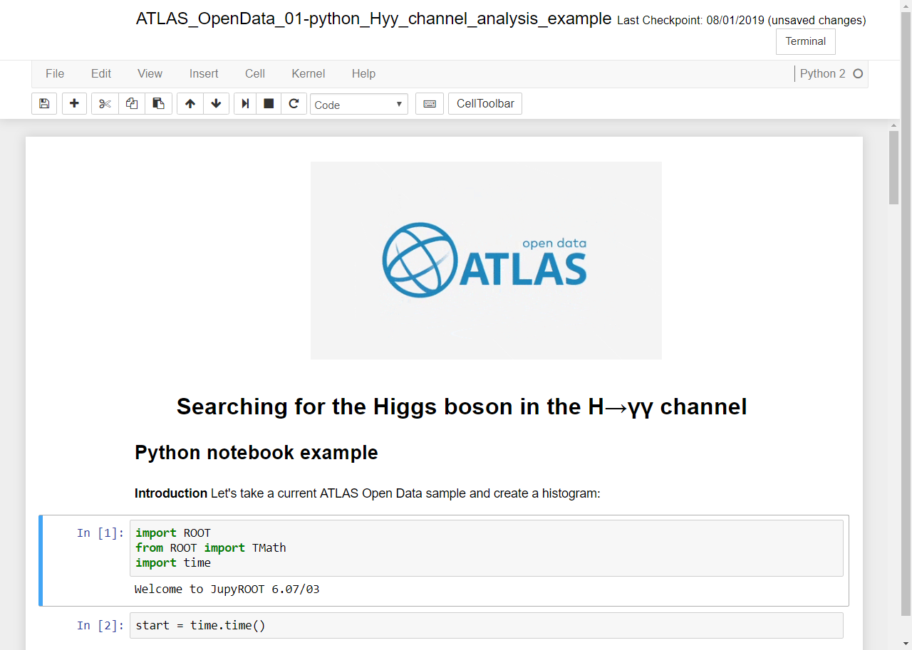

# ROOTbooks with analysis examples

A simple analysis example of a **search for the Higgs boson in the H --> yy (Higgs into two photons) decay channel** is prepared. The analysis example is written in *both C++ and Python* languages with Jupyter notebook and a ROOT kernel and PyROOT extension, and these notebooks are available under this [Github link](https://github.com/atlas-outreach-data-tools/notebooks-collection-opendata).

The analysis example implements a simplified selection criteria for single Higgs boson events decaying to a couple of photons:

+ Diphoton trigger is satisfied;
+ Exactly two photons with transverse energy ET > 35 and 25 GeV, respectively;
+ Leading and subleading photon candidates are respectively required to have ET / myy > 0.35 and 0.25;
+ Diphoton invariant mass myy between 105 GeV and 160 GeV.

The background is estimated from data, without the use of MC simulation, by fitting the diphoton invariant-mass distribution in a range (105 GeV <  myy < 160 GeV) with a [third-order polynomial](https://en.wikipedia.org/wiki/Cubic_function) function with free shape and normalisation parameters. Signal MC simulations of the five main Higgs-boson production mechanisms (ggF, VBF, WH, ZH, tttH) are used to model the shape of the invariant mass of the signal, modelled as a [Gaussian](https://en.wikipedia.org/wiki/Normal_distribution) function.

The final diphoton invariant-mass spectrum in the selected diphoton events is shown below. The solid red curve shows the fitted signal-plus-background model when the Higgs boson mass is constrained to be 125 GeV. The background component of the fit is shown with the dotted blue curve. The signal component of the fit is shown with a solid black curve.

