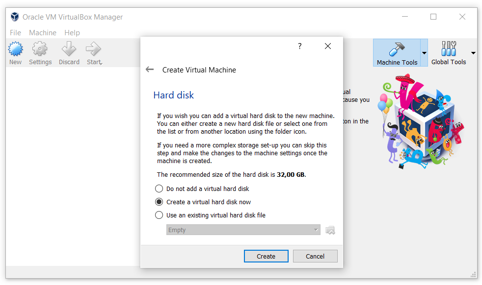
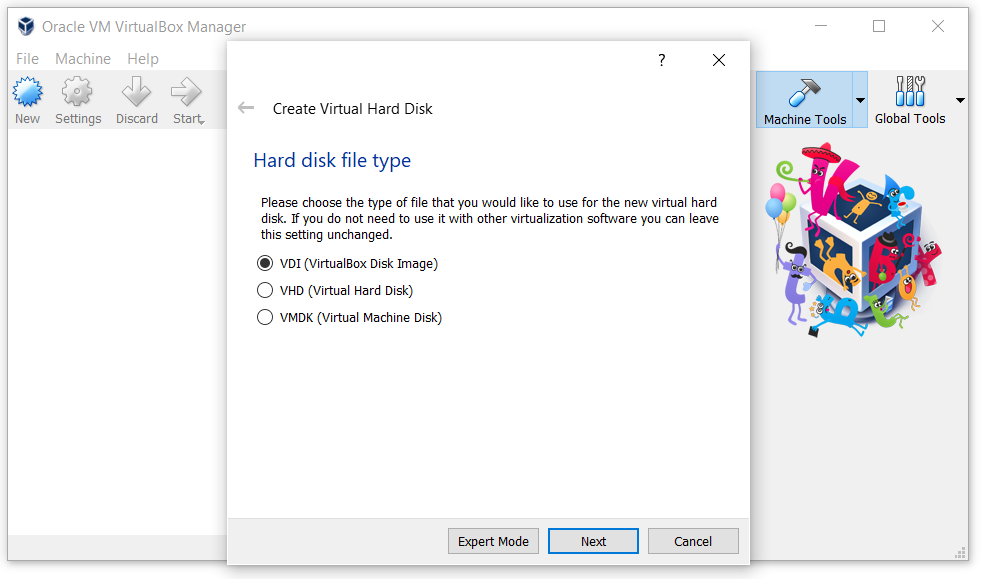
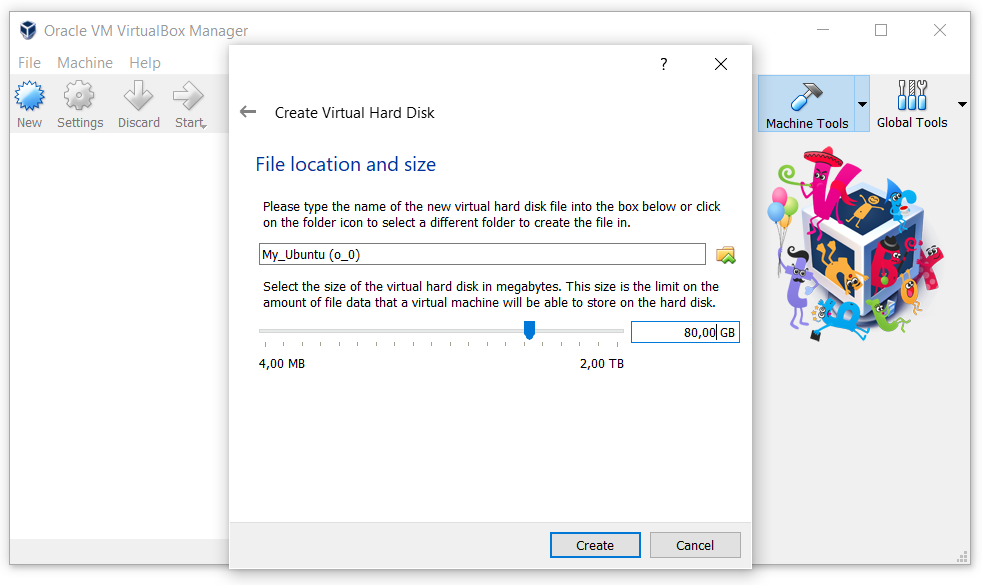
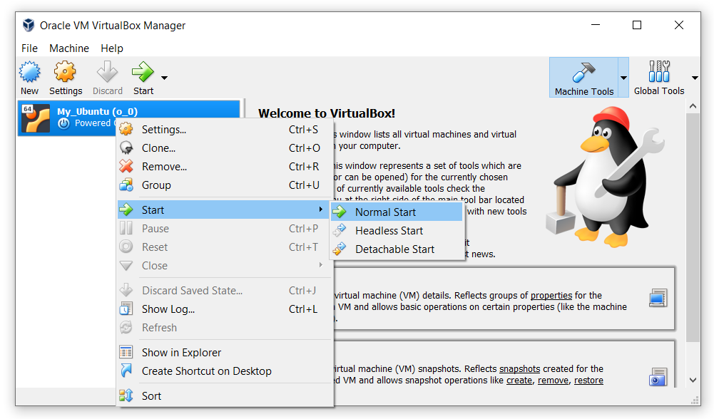
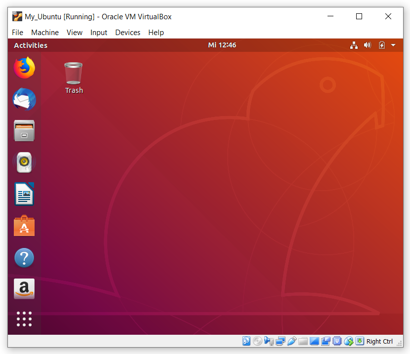

## Ubuntu

* **Create a virtual machine containing Ubuntu**

— Click the "New" button.

— In the settings window specify the "Name" (in the future you can change), the "Type" and "Version" of the operating system and click "Next".  For example - Name: My_Ubuntu (o_0), Type: Linux, Version: Ubuntu (64-bit).

— The machine claims that the minimum memory size (RAM) requirements for full-fledged work Linux,, 1024MB. But if you want your machine to work well, then select the volume for more depending on the RAM of your computer (2 GB if RAM of your computer 8 GB) and click "Next". Sometimes even more, it all depends on the tasks and how many Virtual Machines you will run at the same time.

— So we went to create a virtual hard disk. Click "Create":

— Specify the type of hard disk (VDI - VirtualBox Disk Image) and click "Next":

(Choose the first item, as it is easier. You have created a file that will simulate the hard disk of your virtual machine. If necessary, you can transfer it to another computer and run there).

— In the window that appears, put a tick in "Dynamically allocated", after click "Next":

-The  hard disk size set at least 80 GB (or more) and click "Create".

— Now the Virtual Machine is ready, but without an operating system. Start the Virtual Machine by clicking on the right mouse button and select **"Start" -> "Normal start"**.

— When you first start you will be prompted to select the installation file from which the installation will be performed. You can download the installation file from the [official website](https://ubuntu.com/download/desktop). Select the installation file from the Downloads folder (or where you saved it) and click "Start".

— In the window that appears, select the operating system language and click on "Install Ubuntu". Next, select the keyboard language.

— After selecting the keyboard language, just click on "Continue"

— *Disk layout*. You can choose installation type. Simply format the entire hard drive and install Ubuntu on it, or select the manual option (Set the checkbox to "Something else" option and click "Continue"):

— In the opened window, if you have not yet marked up the hard drive, you need to create a partition table, to do this, click "New Partition Table...".

— Four sections are recommended for Linux:

* / - ext4, size 10-50 GB, for system installation
* /boot - ext2, size 100 MB, for bootloader files
* swap - swap, size equals RAM, for swap
* /home - ext4, all remaining space

— To create a new section, click the "+" button:

— Here you need to specify the mount point, for example, **/** or **/home**, size, file system and you can set a label:

 

— In the end, you should have something like this:

Then click "Install Now".

— You should have this window:

Check that everything is correct, click "Continue".

— Select your time zone:

— Enter your Username, computer name and password:

— Installing your operating system:

— Enjoy your virtual machine:

## VM with Docker container and Jupyter Lab
