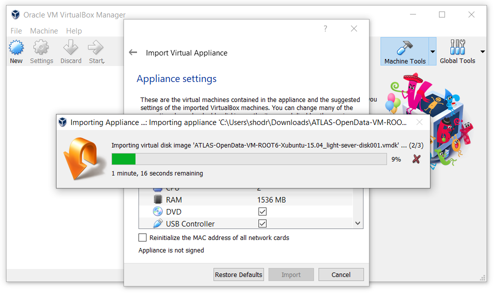

# 13 TeV ATLAS Open Data virtual machine installation

**Download the latest ATLAS Open Data VM**

This is an **Ubuntu 18.04.3 LTS** with:

* **ROOT** 6.18 (configuration all)

* **Jupyter** (bash, python2, python3, ROOT C++ kernels)

* **Extras** TensorFlow + demo git repos

* **Cite with** 

**Check our ~9 min video tutorial to don't miss any detail**

<iframe scrolling="no"  src="https://videos.cern.ch/video/OPEN-VIDEO-2020-018-002" width="100%" height="420" frameborder="0" allowfullscreen></iframe>

## Detailed instructions

+ After you downloaded the VM file, start the VirtualBox. Go to the menu ***"File"*** **->** ***“Import Appliance...”*** (or perform the same function with the combination of buttons: **"Ctrl" + "I"**).

+ In the window, select the downloaded ".ova" file from the **Downloads** folder and click "Next":

+ Click "Import" without any changes:

+ The operating system should begin importing:

— Now your Virtual Machine with Ubuntu-Linux operating system is ready, start it by clicking  and use:

**Download the latest ATLAS Open Data VM**

This is an **Ubuntu 18.04.3 LTS** with:

* **ROOT** 6.18 (configuration all)

* **Jupyter** (bash, python2, python3, ROOT C++ kernels)

* **Extras** TensorFlow + demo git repos

* **Cite with** 

# Previous VM demo on how to run the VM

**Take a look to this video on how to get and run some notebooks and framework in your computer**

<CENTRE>
<iframe width="100%" height="405" src="https://www.youtube.com/embed/Lj73Vjd6Nys?start=52" frameborder="0" allow="accelerometer; autoplay; encrypted-media; gyroscope; picture-in-picture" allowfullscreen></iframe>
</CENTRE>

_ _ _
N.B. If you want to install your operating system (in this case Ubuntu) from scratch, then see how to do it in [***this section***](appendix.md).
_ _ _

<!--

After starting your VM and running the notebooks, you may encounter the following **error** (look at the red frames in the photo below):

To solve this **error**, follow these simple steps:

+ Сlose notebooks and terminal

+ Run the terminal again and type the following code: * `./run-server-jupyter.sh` * to start Jupiter

+ This way you have restarted your terminal and server successfully

+ Open the notebook in your browser and restart the *kernel* by clicking the restart button

+ Now your terminal and server should be working and the notebooks should run without errors

-->
