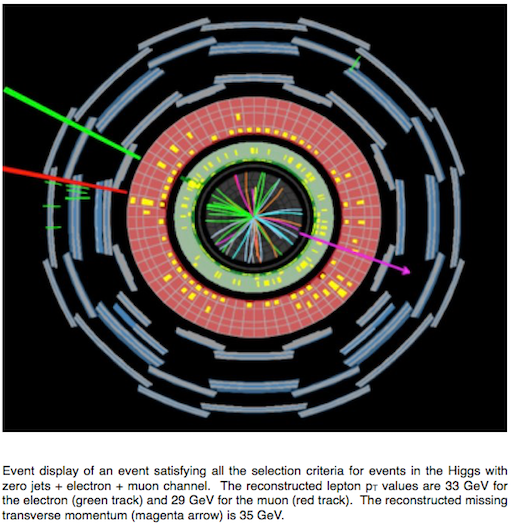
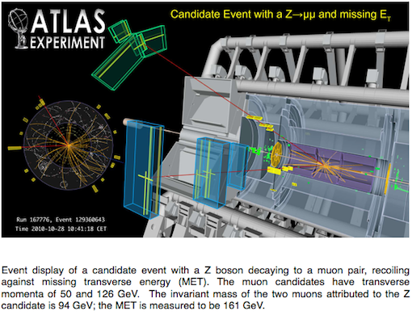

# Analyses

Histogram Analyser focuses on four physics processes; the signal Higgs boson process \(H\rightarrow W^+W^-\) and three background processes \(WW\), \(t\bar t\) and \(Z\).  
Let's take a look at these processes.

## \(H\rightarrow W^+W^-\)

The [Higgs boson](https://home.cern/topics/higgs-boson) is an essential ingredient of the [Standard Model](https://home.cern/about/physics/standard-model) of particle physics, the theory that describes all known elementary particles and their interactions.

The Higgs boson interacts with all Standard Model elementary particles having mass.  Thus, there are different ways to produce a Higgs boson, and different ways for a Higgs boson to decay to other particles.

One of the most likely ways a Higgs boson will decay is into a pair of \(W\) bosons.  This happens about 21% of the time for a Higgs boson with a mass of 125 GeV.  The \(W\) bosons can subsequently decay either into a quark-antiquark (\(q \bar q\)), a lepton-antineutrino (\(\ell^- \bar\nu\)), or an antilepton-neutrino (\(\ell^+\nu\)) pair.

The signal process in Histogram Analyser is the Higgs boson decaying into two \(W\) bosons which subsequently decay into leptons  (\(\ell\)) and neutrinos (\(\nu\)):

\(H\rightarrow W^+W^-\rightarrow \ell^+ \ell^-\nu \bar\nu\)   

(lepton = electron or muon in this case).

A key feature, or **signature** of this signal process, is an isolated high-\(p_\text{T}\) lepton.  The term \(p_\text{T}\) stands for transverse momentum, the component of momentum perpendicular to the beam line (colliding protons).  Unfortunately, the main background processes also contain isolated high-\(p_\text{T}\) leptons from \(W\) or \(Z\) boson decays.

Often physicists refer to a particle and its antiparticle collectively by just the particle's name.  So, when we talk about quarks we mean quarks and antiquarks.  Similarly for leptons and antileptons,  neutrinos and antineutrinos.  It is a shorthand that physicists adopt for brevity.

## \(WW\)

The \(W\) boson is a fundamental particle. Together with the \(Z\) boson, it is responsible for the weak force, one of four fundamental forces that govern the behaviour of matter in our universe.

\(W\) boson pair production occurs via

* **quark–antiquark annihilation:** \(q\bar q \rightarrow W^+W^-\)

* **diphoton process:**  \(\gamma\gamma\rightarrow W^+W^-\)

* **gluon fusion:** \(gg\rightarrow W^+W^-\)

\(W\) boson pair production is an important process for checks of the [gauge structure](https://en.wikipedia.org/wiki/Gauge_theory) of the Standard Model and the search for [new physics](https://en.wikipedia.org/wiki/Physics_beyond_the_Standard_Model). It is an irreducible background for many Higgs boson studies and new physics searches.

\(W\) bosons can decay either

* [leptonically](https://en.wikipedia.org/wiki/Lepton): into an electron or muon and neutrino. 
* [hadronically](https://en.wikipedia.org/wiki/Hadron): into an up-type quark and a down-type quark.

Leptonic \(W\) boson decays are characterised by the presence of a highly energetic isolated lepton and large missing transverse momentum.  Missing transverse momentum can occur due to neutrinos escaping detection.

Hadronic \(W\) boson decays lead to the presence of two jets due to the two quarks.

Only leptonic decays are considered in Histogram Analyser.  The \(WW\) process will thus be seen in the electron-electron (ee), muon-muon (mm) and electron-muon (em) channel.

Final states with leptons and missing energy are typical for many new physics models, [supersymmetry](https://home.cern/about/physics/supersymmetry) is a classic example, but also for many Standard Model processes.

Understanding the Standard Model processes possessing multiple leptons and missing energy is crucial in the quest to discover or rule out new models.

## \(t\bar t\)

Monte Carlo data simulation generators, QCD models and parton distribution functions are very reliant on theoretical models. Due to the very high energy of top pairs, top pair data can verify important areas of the aforementioned models and test how good the models are.

Top quark pair production is an important background in various Higgs boson analyses and beyond the Standard Model searches.  It is therefore crucial to understand this process in detail.

Top quarks decay with close to 100% probability into a W boson and a bottom quark.  The \(W\) in turns decays equally to a pair of leptons or a pair of quarks.  Since there are three colours for every quark the \(W\) boson decay to two jets is three times more probable than its decay to an electron or a muon.

The two bottom-quarks from the two top-quark decays will be seen as two jets in the final state.  
Algorithms are used to identify these jets. Jets thought to originate from \(b\)-quarks are called b-tagged jets.  
Additional jets in \(t \bar t \) events can originate from gluon radiation.

Since almost all the energy of the decay products is derived from the rest energy of the top/anti-top pair, finding the total energy of all the decay products and summing should yield the rest energy (and therefore mass) of the particles that have decayed.  But the detector can only "see" the charged particles.  It misses the neutrinos produced in the decay. 

## \(Z\)

The [\(W\)](http://home.cern/about/physics/w-boson-sunshine-and-stardust) and [\(Z\)](http://home.cern/about/physics/z-boson) bosons are together known as the weak or intermediate vector bosons.

At the LHC, \(Z\) bosons are produced by:

* **Drell-Yan **: \( q \bar q \rightarrow Z/\gamma^* \rightarrow \mu^+\mu^-\) (65%). A quark of one proton and an antiquark of another proton annihilate, creating a [virtual photon](https://en.wikipedia.org/wiki/Virtual_particle) or \(Z\) boson which then decays into a pair of oppositely-charged leptons.

* **Quark gluon scattering**: \(qg \rightarrow qZ/γ^* \rightarrow q\mu^+\mu^-\) (35%). A quark and a [gluon](https://en.wikipedia.org/wiki/Gluon) interact and the quark radiates a virtual photon or \(Z\) boson which then decays into a pair of oppositely-charged leptons.

A \(Z\) boson then decays into a:

* **quark-antiquark pair** (70%). These appear as jets.  If the jets are identified as originating from \(b\)-quarks they will be b-tagged.

* **neutrino-antineutrino pair** (20%).  Neutrinos do not interact and so are very difficult to detect.  This neutrino decay mode can sometimes be identified by missing transverse momentum.

* **lepton-antilepton pairs** (10%).  The three lepton-pair types are equally probable, electron-positron, muon-antimuon, and tau-antitau pairs.

A \(Z\) boson is neutral and so the sum of the charges of its decay products must be zero.

In Histogram Analyser the lepton-antilepton pair production can be studied in the electron-electron (ee) and muon-muon (mm) channel.  Decays to taus are not considered in Histogram Analyser since lectrons and muons are much easier to measure than taus.

