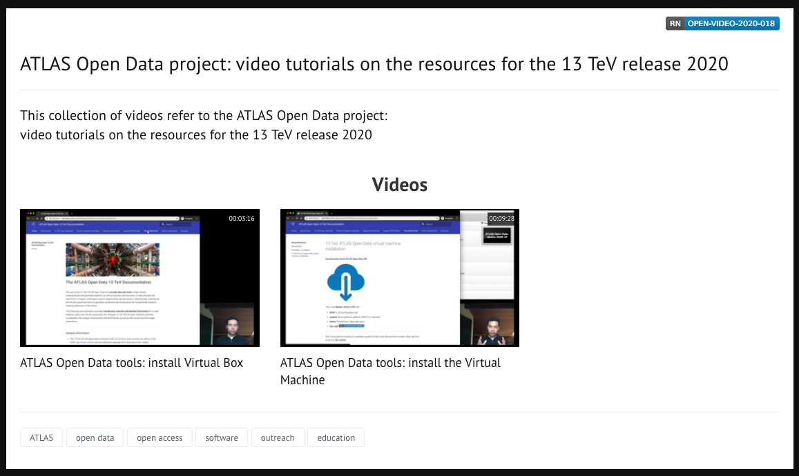

# 13 TeV ATLAS Open Data virtual machine

The 13 TeV ATLAS Open Data [virtual machine](https://en.wikipedia.org/wiki/Virtualization) (VM) allows you to create a virtual (rather than actual) operating system and test the 13 TeV ATLAS Open Data on your own host machine.

First, you will find below the instruction of how to install the Oracle VirtualBox, and after that the 13 TeV ATLAS Open Data virtual machine.

Follow the video tutorials in our CDS collection **[here](https://videos.cern.ch/record/2715261)**

