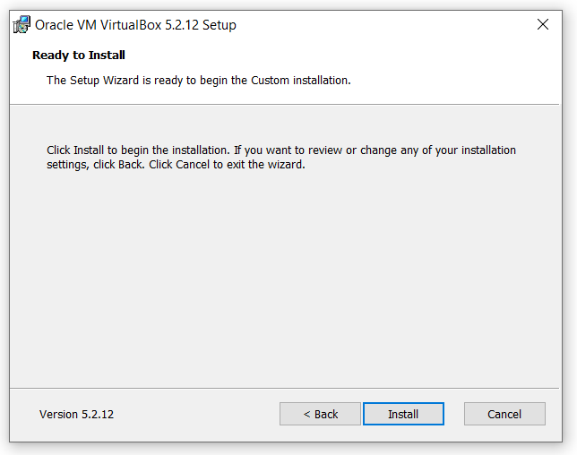

# Oracle VirtualBox installation

The Oracle VirtualBox is the chosen software that supports Microsoft Windows, Linux, FreeBSD, Mac OS X, Solaris / OpenSolaris, ReactOS, DOS and other systems. Follow the instructions below to **install the VM** on your computer:

— Download VirtualBox you can free on the **[official website](https://www.virtualbox.org/)**.

**Check our ~3 min video tutorial to don't miss any detail**

<iframe scrolling="no"  src="https://videos.cern.ch/video/OPEN-VIDEO-2020-018-001" width="100%" height="420" frameborder="0" allowfullscreen></iframe>

## Detailed instructions

— **What version to download?** Assumption of what your operating system. In this review we will explain how to install VirtualBox on Windows 10. Installing VirtualBox on all versions of Windows is identical. First download the installation file.

— After you downloaded the latest version of Virtual Box, proceed with the installation. Find the downloaded file in your computer (usually the downloaded file is in *С:\Users\User\Downloads\"filename"*), run the program and click "Next".

— After that, the component selection window will appear. Without changing anything, click "Next".

— In the next window, without any changing click "Next"

— Now a window will appear that says that the Internet will be temporarily disabled during the installation of the program. Click "Yes".

— And click "Install" to begin the installation.

— After the installation process is complete, click "Finish"

— Now you will see a clean window of your virtual machine without any operating systems:

* **Configure VirtualBox**

— If you have English installed on your system, the program will automatically change the interface language to English when you first start it. If this does not happen, go to the menu *“File” -> “Settings\or/Preferences”* and on the *Languages* tab select your *language*.

